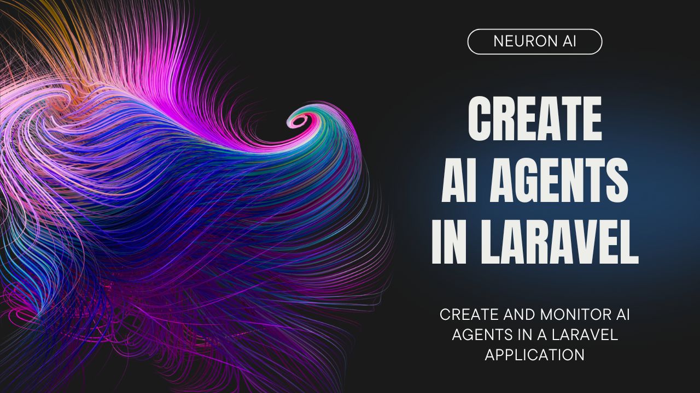

# FORK: Create Full-Featured Agentic Applications in PHP

[](https://packagist.org/packages/inspector-apm/neuron-ai)
[](https://packagist.org/packages/inspector-apm/neuron-ai)

> [!IMPORTANT]
> Get early access to new features, exclusive tutorials, and expert tips for building AI agents in PHP. Join a community of PHP developers pioneering the future of AI development.
> [Subscribe to the newsletter](https://neuron-ai.dev)

> Before moving on, support the community giving a GitHub star ⭐️. Thank you!

## What is Neuron?

Neuron is a PHP framework for creating and orchestrating AI Agents. It allows you to integrate AI entities in your existing
PHP applications with a powerful and flexible architecture. We provide tools for the entire agentic application development lifecycle,
from LLM interfaces, to data loading, to multi-agent orchestration, to monitoring and debugging.
In addition, we provide tutorials and other educational content to help you get started using AI Agents in your projects.

[**Laravel Tutorial**](https://www.youtube.com/watch?v=oSA1bP_j41w)

[](https://www.youtube.com/watch?v=oSA1bP_j41w)

## Requirements

- PHP: ^8.1

## Official documentation

**[Go to the official documentation](https://docs.neuron-ai.dev/)**

## Guides & Tutorials

Check out the technical guides and tutorials archive to learn how to start creating your AI Agents with Neuron
https://docs.neuron-ai.dev/overview/fast-learning-by-video.

Neuron is the perfect AI branch of your favorite framework.

## Laravel
Neuron offers a well-defined encapsulation pattern, allowing you to work on your AI components in a dedicated namespace.
You can enjoy the exact same experience of the other ecosystem packages you already love, like Filament, Nova, Horizon, Pennant, etc.

[Example project (GitHub)](https://github.com/neuron-core/laravel-travel-agent)

## Symfony

All Neuron components belong to its own interface, so you can easily define dependencies and automate objects creation
using the Symfony service container. Watch how it works in a real project.

[Symfony & Neuron (YouTube)](https://www.youtube.com/watch?v=JWRlcaGnsXw)

## How To

- [Install](#install)
- [Create an Agent](#create)
- [Talk to the Agent](#talk)
- [Monitoring](#monitoring)
- [Supported LLM Providers](#providers)
- [Tools & Toolkits](#tools)
- [MCP Connector](#mcp)
- [Structured Output](#structured)
- [RAG](#rag)
- [Workflow](#workflow)
- [Security Vulnerabilities](#security)
- [Official Documentation](#documentation)

<a name="install">

## Install

Install the latest version of the package:

```
composer require neuron-core/neuron-ai
```

<a name="create">

## Create an Agent

Neuron provides you with the Agent class you can extend to inherit the main features of the framework
and create fully functional agents. This class automatically manages some advanced mechanisms for you, such as memory,
tools and function calls, up to the RAG systems. You can go deeper into these aspects in the [documentation](https://docs.neuron-ai.dev).

Let's create an Agent with the command below:

```
php vendor/bin/neuron make:agent DataAnalystAgent
```

```php
<?php

namespace App\Neuron;

use NeuronAI\Agent;
use NeuronAI\Agent\SystemPrompt;
use NeuronAI\Providers\AIProviderInterface;
use NeuronAI\Providers\Anthropic\Anthropic;

class DataAnalystAgent extends Agent
{
    protected function provider(): AIProviderInterface
    {
        return new Anthropic(
            key: 'ANTHROPIC_API_KEY',
            model: 'ANTHROPIC_MODEL',
        );
    }

    protected function instructions(): string
    {
        return (string) new SystemPrompt(
            background: [
                "You are a data analyst expert in creating reports from SQL databases."
            ]
        );
    }
}
```

The `SystemPrompt` class is designed to take your base instructions and build a consistent prompt for the underlying model
reducing the effort for prompt engineering.

<a name="talk">

## Talk to the Agent

Send a prompt to the agent to get a response from the underlying LLM:

```php

$agent = DataAnalystAgent::make();


$response = $agent->chat(
    new UserMessage("Hi, I'm Valerio. Who are you?")
);
echo $response->getContentBlocks();
// I'm a data analyst. How can I help you today?


$response = $agent->chat(
    new UserMessage("Do you remember my name?")
);
echo $response->getContentBlocks();
// Your name is Valerio, as you said in your introduction.
```

As you can see in the example above, the Agent has memory of the ongoing conversation. Learn more about memory in the [documentation](https://docs.neuron-ai.dev/components/chat-history-and-memory).

<a name="monitoring">

## Monitoring & Debugging

Integrating AI Agents into your application you’re not working only with functions and deterministic code,
you program your agent also influencing probability distributions. Same input ≠ output.
That means reproducibility, versioning, and debugging become real problems.

Many of the Agents you build with Neuron will contain multiple steps with multiple invocations of LLM calls,
tool usage, access to external memories, etc. As these applications get more and more complex, it becomes crucial
to be able to inspect what exactly your agent is doing and why.

Why is the model taking certain decisions? What data is the model reacting to? Prompting is not programming
in the common sense. No static types, small changes break output, long prompts cost latency,
and no two models behave exactly the same with the same prompt.

The best way to take your AI application under control is with [Inspector](https://inspector.dev). After you sign up,
make sure to set the `INSPECTOR_INGESTION_KEY` variable in the application environment file to start monitoring:

```dotenv
INSPECTOR_INGESTION_KEY=fwe45gtxxxxxxxxxxxxxxxxxxxxxxxxxxxx
```

After configuring the environment variable, you will see the agent execution timeline in your Inspector dashboard.


Learn more about Monitoring in the [documentation](https://docs.neuron-ai.dev/advanced/observability).

<a name="providers">

## Supported LLM Providers

With Neuron, you can switch between [LLM providers](https://docs.neuron-ai.dev/components/ai-provider) with just one line of code, without any impact on your agent implementation.
Supported providers:

- [Anthropic](https://docs.neuron-ai.dev/components/ai-provider#anthropic)
- [OpenAI](https://docs.neuron-ai.dev/components/ai-provider#openai) (also as an [embeddings provider](https://docs.neuron-ai.dev/components/embeddings-provider#openai))
- [OpenAI on Azure](https://docs.neuron-ai.dev/components/ai-provider#azureopenai)
- [Ollama](https://docs.neuron-ai.dev/components/ai-provider#ollama) (also as an [embeddings provider](https://docs.neuron-ai.dev/components/embeddings-provider#ollama))
- [OpenAILike](https://docs.neuron-ai.dev/components/ai-provider#openailike)
- [Gemini](https://docs.neuron-ai.dev/components/ai-provider#gemini) (also as an [embeddings provider](https://docs.neuron-ai.dev/components/embeddings-provider#gemini))
- [Mistral](https://docs.neuron-ai.dev/components/ai-provider#mistral)
- [HuggingFace](https://docs.neuron-ai.dev/components/ai-provider#huggingface)
- [Deepseek](https://docs.neuron-ai.dev/components/ai-provider#deepseek)
- [Grok](https://docs.neuron-ai.dev/components/ai-provider#grok-x-ai)
- [AWS Bedrock Runtime](https://docs.neuron-ai.dev/components/ai-provider#aws-bedrock-runtime)

<a name="tools">

## Tools & Toolkits

Make your agent able to perform concrete tasks, like reading from a database, by adding tools or toolkits (collections of tools).

```php
<?php

namespace App\Neuron;

use NeuronAI\Agent;
use NeuronAI\Providers\AIProviderInterface;
use NeuronAI\Providers\Anthropic\Anthropic;
use NeuronAI\Agent\SystemPrompt;
use NeuronAI\Tools\ToolProperty;
use NeuronAI\Tools\Tool;
use NeuronAI\Tools\Toolkits\MySQL\MySQLToolkit;

class DataAnalystAgent extends Agent
{
    protected function provider(): AIProviderInterface
    {
        return new Anthropic(
            key: 'ANTHROPIC_API_KEY',
            model: 'ANTHROPIC_MODEL',
        );
    }

    protected function instructions(): string
    {
        return (string) new SystemPrompt(
            background: [
                "You are a data analyst expert in creating reports from SQL databases."
            ]
        );
    }

    protected function tools(): array
    {
        return [
            MySQLToolkit::make(
                \DB::connection()->getPdo()
            ),
        ];
    }
}
```

Ask the agent something about your database:

```php
$response = DataAnalystAgent::make()->chat(
    new UserMessage("How many orders we received today?")
);

echo $response->getContentBlocks();
```

Learn more about Tools in the [documentation](https://docs.neuron-ai.dev/getting-started/tools).

<a name="mcp">

## MCP Connector

Instead of implementing tools manually, you can connect tools exposed by an MCP server with the `McpConnector` component:

```php
<?php

namespace App\Neuron;

use NeuronAI\Agent;
use NeuronAI\MCP\McpConnector;
use NeuronAI\Providers\AIProviderInterface;
use NeuronAI\Providers\Anthropic\Anthropic;
use NeuronAI\Tools\ToolProperty;
use NeuronAI\Tools\Tool;

class DataAnalystAgent extends Agent
{
    protected function provider(): AIProviderInterface
    {
        ...
    }

    protected function instructions(): string
    {
        ...
    }

    protected function tools(): array
    {
        return [
            // Connect to an MCP server
            ...McpConnector::make([
                'command' => 'npx',
                'args' => ['-y', '@modelcontextprotocol/server-everything'],
            ])->tools(),
        ];
    }
}
```

Learn more about MCP connector in the [documentation](https://docs.neuron-ai.dev/getting-started/mcp-connector).

<a name="structured">

## Structured Output
There are scenarios where you need Agents to understand natural language, but output in a structured format, like
business processes automation, data extraction, etc. to use the output with some other downstream system.

```php
use App\Neuron\MyAgent;
use NeuronAI\Chat\Messages\UserMessage;
use NeuronAI\StructuredOutput\SchemaProperty;

/*
 * Define the output structure as a PHP class.
 */
class Person
{
    #[SchemaProperty(description: 'The user name')]
    public string $name;

    #[SchemaProperty(description: 'What the user love to eat')]
    public string $preference;
}

// Talk to the agent requiring the structured output
$person = MyAgent::make()->structured(
    new UserMessage("I'm John and I like pizza!"),
    Person::class
);

echo $person->name ' like '.$person->preference;
// John like pizza
```

Learn more about Structured Output on the [documentation](https://docs.neuron-ai.dev/getting-started/structured-output).

<a name="rag">

## RAG

To create a RAG you need to attach some additional components other than the AI provider, such as a `vector store`,
and an `embeddings provider`.

Let's create a RAG with the command below:

```
php vendor/bin/neuron make:rag MyChatBot
```

Here is an example of a RAG implementation:

```php
<?php

namespace App\Neuron;

use NeuronAI\Providers\AIProviderInterface;
use NeuronAI\Providers\Anthropic\Anthropic;
use NeuronAI\RAG\Embeddings\EmbeddingsProviderInterface;
use NeuronAI\RAG\Embeddings\VoyageEmbeddingProvider;
use NeuronAI\RAG\RAG;
use NeuronAI\RAG\VectorStore\PineconeVectorStore;
use NeuronAI\RAG\VectorStore\VectorStoreInterface;

class MyChatBot extends RAG
{
    protected function provider(): AIProviderInterface
    {
        return new Anthropic(
            key: 'ANTHROPIC_API_KEY',
            model: 'ANTHROPIC_MODEL',
        );
    }

    protected function embeddings(): EmbeddingsProviderInterface
    {
        return new VoyageEmbeddingProvider(
            key: 'VOYAGE_API_KEY',
            model: 'VOYAGE_MODEL'
        );
    }

    protected function vectorStore(): VectorStoreInterface
    {
        return new PineconeVectorStore(
            key: 'PINECONE_API_KEY',
            indexUrl: 'PINECONE_INDEX_URL'
        );
    }
}
```

Learn more about RAG in the [documentation](https://docs.neuron-ai.dev/getting-started/rag).

<a name="workflow">

## Workflow
Think of a Workflow as a smart flowchart for your AI applications. The idea behind Workflow is to allow developers
to use all the Neuron components like AI providers, embeddings, data loaders, chat history, vector store, etc,
as standalone components to create totally customized agentic entities.

Agent and RAG classes represent a ready to use implementation of the most common patterns when it comes
to retrieval use cases, or tool calls, structured output, etc. Workflow allows you to program your
agentic system completely from scratch. Agent and RAG can be used inside a Workflow to complete tasks
as any other component if you need their built-in capabilities.

[](https://docs.neuron-ai.dev/v2/workflow/getting-started)

Neuron Workflow supports a robust [**human-in-the-loop**](https://docs.neuron-ai.dev/workflow/human-in-the-loop)
pattern, enabling human intervention at any point in an automated process. This is especially useful in
large language model (LLM)-driven applications where model output may require validation, correction,
or additional context to complete the task.

Learn more about Workflow on the [documentation](https://docs.neuron-ai.dev/workflow/getting-started).

<a name="security">

## Security Vulnerabilities
If you discover a security vulnerability within Neuron, please send an e-mail to the Inspector team via support@inspector.dev.
All security vulnerabilities will be promptly addressed.

<a name="documentation">

## Official documentation

**[Go to the official documentation](https://neuron.inspector.dev/)**


