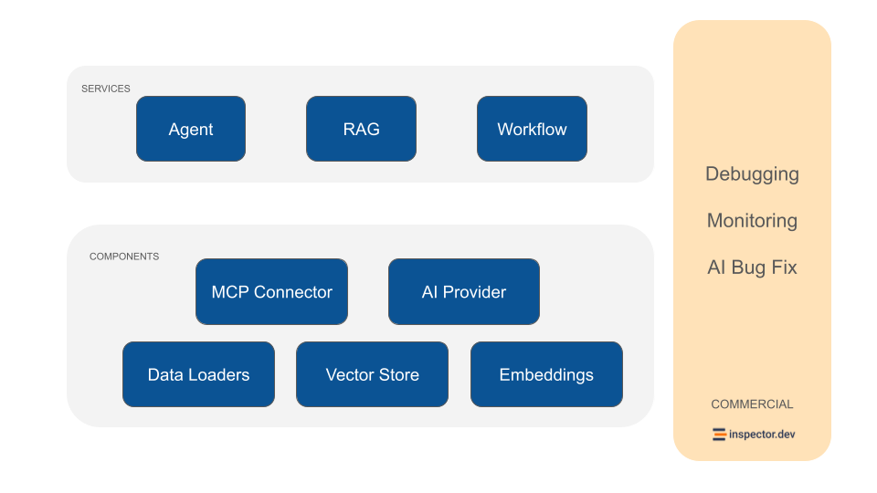

# Introduction

NeuronAI is a framework that helps you create AI Agents in PHP faster and with less effort using the technology you already use and love.&#x20;

Neuron makes AI Agents development accessible, reliable, and scalable. If you're just taking your first steps into AI Agents development, Neuron's extensive documentation, [guides](getting-started/fast-learning-by-video.md) and [tutorials](getting-started/fast-learning-by-video.md) will help you delve deeper into core concepts at your pace.

<figure><figcaption><p>NeuronAI architecture</p></figcaption></figure>

### Developer Experience

Neuron's architecture prioritizes the fundamentals that experienced engineers expect from production-grade software. The framework leverages PHP 8's mature type system throughout its codebase, with every method signature, property, and return value explicitly typed.&#x20;

***

#### Strong Typing System

This isn't just documentation—it's enforced contract specification that catches integration errors at development time rather than in production. The entire framework passes PHPStan 100% type coverage, ensuring that type safety extends beyond basic scalar types to complex object relationships and generic collections.

***

#### Well Defined Interfaces

The components architecture follows strict interface segregation principles, where each component operates through well-defined contracts. This design enables you to swap implementations without cascading changes through your application. Need to switch from OpenAI to Anthropic? Change the AI provider. Want to move from in-memory to SQL-backed conversation storage? Swap the chat history component. The interface boundaries make these transitions straightforward rather than architectural overhauls.

***

#### IDE Friendly

The strongly-typed approach means your IDE can provide accurate autocompletion for agent configurations, tool parameters, and response handling. Method signatures include detailed PHPDoc annotations that provide context beyond type hints when needed, explaining parameter expectations and return value structures.

***

This foundation translates to faster debugging cycles, easy integration patterns with frameworks like Symfony or Laravel, and the ability to confidently refactor AI logic as requirements evolve. We assume you're building systems that need to be maintained, extended, and understood by teams rather than individual experiments.

### Agnostic Architecture

One of Neuron's fundamental design principles is complete framework independence. Unlike many PHP libraries that tie themselves to specific frameworks like Laravel or Symfony, Neuron operates as a standalone component that integrates seamlessly with any PHP stack.

Whether you're working within a Laravel application, a Symfony project, a WordPress plugin, or a custom MVC framework, Neuron integrates seamlessly with your existing codebase without refactoring or disrupting established workflows.

The framework-agnostic approach extends to dependency management as well. Neuron uses standard PSR interfaces where appropriate and maintains minimal external dependencies, avoiding dependencies conflit across different PHP environments and framework versions. This design choice prevents the common problem where introducing a new library requires adopting an entire framework's ecosystem or waiting for dependencies update before moving to a new version.

For teams working across multiple projects, this approach provides consistency. The same Neuron patterns and implementations work regardless of whether you're building a new microservice in Slim, extending a WordPress site, or adding features to an enterprise Symfony and Laravel application. Knowledge transfer between projects becomes seamless, and developers can leverage their Neuron expertise across their entire PHP portfolio.

### Community Driven

These design principles create a unified ecosystem for AI development across all PHP communities. Rather than fragmenting innovation across framework-specific solutions, Neuron enables collaboration between Laravel developers, Symfony contributors, WordPress plugin authors, and custom framework maintainers. When improvements are made to Neuron's core capabilities, they benefit every PHP developer regardless of their architectural preferences.

The result is a larger, more diverse community working toward common goals. Framework-specific AI libraries naturally limit their contributor base to developers familiar with that particular framework. Neuron's universal approach attracts contributors from across the PHP ecosystem, leading to more robust implementations, broader testing across different environments, and faster development of new features. This collaborative approach also means better support for newcomers, as experienced developers from various PHP backgrounds can provide guidance and assistance regardless of which framework someone happens to be learning alongside Neuron.

### Production Readiness

Integrating AI Agents into your application you’re not working only with functions and deterministic code, you program your agent also influencing probability distributions. Same input ≠ output. That means reproducibility, versioning, and debugging become real problems.

The [Inspector](https://inspector.dev/) team designed NeuronAI with built-in observability features, so you can monitor AI agents were running, helping you maintain production-grade implementations with confidence.

Error handling and retry mechanisms are built into the framework, ensuring your agents can gracefully handle failures, rate limits, and other common issues in production environments.&#x20;

### Support For Multiple Providers

Neuron uses a common interface for large language models (`AIProviderInterface`) as well as for the other components, such as [embedding](components/embeddings-provider.md), [vector stores](components/vector-store.md), [toolkits](getting-started/tools.md#toolkits-composable-agent-capabilities), etc. The modular architecture allows you to swap components as needed, whether you're changing language model providers, adjusting memory backends, or scaling across multiple servers.



```php
namespace App\Neuron;

use NeuronAI\Agent;
use NeuronAI\Chat\Messages\UserMessage;
use NeuronAI\Providers\AIProviderInterface;
use NeuronAI\Providers\Anthropic\Anthropic;

class MyAgent extends Agent
{
    protected function provider(): AIProviderInterface
    {
        return new Anthropic(
            key: 'ANTHROPIC_API_KEY',
            model: 'ANTHROPIC_MODEL',
        );
    }
}

echo MyAgent::make()->chat(new UserMessage("Hi!"));
// Hi, how can I help you today?
```



```php
namespace App\Neuron;

use NeuronAI\Agent;
use NeuronAI\Chat\Messages\UserMessage;
use NeuronAI\Providers\AIProviderInterface;
use NeuronAI\Providers\Ollama\Ollama;

class MyAgent extends Agent
{
    protected function provider(): AIProviderInterface
    {
        return new Ollama(
            url: 'OLLAMA_URL',
            model: 'OLLAMA_MODEL',
        );
    }
}

echo MyAgent::make()->chat(new UserMessage("Hi!"));
// Hi, how can I help you today?
```



```php
namespace App\Neuron;

use NeuronAI\Agent;
use NeuronAI\Chat\Messages\UserMessage;
use NeuronAI\Providers\AIProviderInterface;
use NeuronAI\Providers\OpenAI\OpenAI;

class MyAgent extends Agent
{
    protected function provider(): AIProviderInterface
    {
        return new OpenAI(
            key: 'OPENAI_API_KEY',
            model: 'OPENAI_MODEL',
        );
    }
}

echo MyAgent::make()->chat(new UserMessage("Hi!"));
// Hi, how can I help you today?
```



```php
namespace App\Neuron;

use NeuronAI\Agent;
use NeuronAI\Chat\Messages\UserMessage;
use NeuronAI\Providers\AIProviderInterface;
use NeuronAI\Providers\Gemini\Gemini;

class MyAgent extends Agent
{
    protected function provider(): AIProviderInterface
    {
        return new Gemini(
            key: 'GEMINI_API_KEY',
            model: 'GEMINI_MODEL',
        );
    }
}

echo MyAgent::make()->chat(new UserMessage("Hi!"));
// Hi, how can I help you today?
```



```php
namespace App\Neuron;

use NeuronAI\Agent;
use NeuronAI\Chat\Messages\UserMessage;
use NeuronAI\Providers\AIProviderInterface;
use NeuronAI\Providers\HuggingFace\HuggingFace;
use NeuronAI\Providers\HuggingFace\InferenceProvider;

class MyAgent extends Agent
{
    public function provider(): AIProviderInterface
    {
        return new HuggingFace(
            key: 'HF_ACCESS_TOKEN',
            model: 'mistralai/Mistral-7B-Instruct-v0.3',
        );
    }
}

echo MyAgent::make()->chat(new UserMessage("Hi!"));
// Hi, how can I help you today?
```



Check out all the supported providers in the [AI Provider](components/ai-provider.md) section.

## What is an AI Agent

An AI agent is a software component whose output is generated by an Artificial Intelligence. These components can understand and respond to customer inquiries without human intervention. They are created using an agent development kit, like NeuronAI, to connect additional components and handle a wide range of tasks. These intelligent agents can include anything from answering simple questions to resolving complex issues that require reasoning, decision making, and proactive interactions with external systems.

Compared to a raw LLM (that primarily provide information and respond to questions within a conversation), AI agents can augment their knowledge with external sources, and take independent actions to complete tasks.

While a simple LLM can answer your questions directly during a conversation, an AI agent might be able to:

* Research information across multiple websites and compile it for you
* Manage your email by responding to simple messages
* Read data from your database and alert you via email when something important happens

The key characteristic that distinguishes agents from traditional software is their ability to operate with incomplete information and adapt to changing requirements.

### Why Build AI Agents in PHP?&#x20;

PHP remains one of the most widely deployed server-side languages, powering the majority of web applications worldwide. If you're already working with PHP, Neuron allows you to integrate AI capabilities directly into your existing codebase without learning new languages or restructuring your applications. This approach significantly reduces the barrier to entry for adding intelligence to web app, content management systems, e-commerce platforms, and business backend applications.

Modern PHP offers robust object-oriented programming features, strong typing capabilities, and excellent performance characteristics that make it well-suited for AI Agents development. The language's mature ecosystem, and straightforward deployment model provide a solid foundation for building reliable agentic systems.

### Getting Started With A Video Tutorial



## Ecosystem

### [E-Book - "Start With AI Agents In PHP"](https://www.amazon.it/dp/B0F1YX8KJB)

The gap between modern agentic technologies and traditional PHP development has been widening in recent years. While Python developers enjoy a wealth of libraries and frameworks to create AI Agents, PHP developers have often been left wondering how they can participate in this technological revolution without completely retooling their skillsets or rebuilding their applications from scratch.

Neuron changes all that.

This book serves as both an introduction to AI Agents concepts for developers and a comprehensive guide to Neuron framework.

[https://www.amazon.it/dp/B0F1YX8KJB](https://www.amazon.it/dp/B0F1YX8KJB)

### [Newsletter](https://neuron-ai.dev)

Register to the Neuron internal [newsletter](https://neuron-ai.dev/) to get informative papers, articles, and best practices on how to start with AI development in PHP.

You will learn how to approach AI systems in the right way, understand the most important technical concepts behind LLMs, and how to start implementing your AI solutions into your PHP application with the Neuron AI framework.

### [Forum](https://github.com/inspector-apm/neuron-ai/discussions)

We’re using [Discussions](https://github.com/inspector-apm/neuron-ai/discussions) as a place to connect with PHP developers working on Neuron to create their Agentic applications. We hope that you:

* Ask questions you’re wondering about.
* Share ideas.
* Engage with other community members.
* Welcome others and are open-minded.

### [**Inspector.dev**](https://inspector.dev)

Neuron is part of the Inspector ecosystem as a trustable platform to create reliable and scalable AI driven solutions.&#x20;

Trace and evaluate your agents execution flow to help you maintain production grade implementations with confidence. Check out the [**observability integrations**](advanced/observability.md).

## Core components

* [**AI Provider**](components/ai-provider.md)
* [**Toolkits**](getting-started/tools.md#toolkits-composable-agent-capabilities)
* [**Embeddings Provider**](components/embeddings-provider.md)
* [**Data Loader**](components/data-loader.md)
* [**Vector Store**](components/vector-store.md)
* [**Chat History**](components/chat-history-and-memory.md)
* [**MCP connector**](advanced/mcp-connector.md)
* [**Observability**](advanced/observability.md)
* [**Post Processors**](components/pre-post-processor.md)
* [**Workflow**](workflow/getting-started.md)

## Additional Resources

* Repository: [https://github.com/inspector-apm/neuron-ai](https://github.com/inspector-apm/neuron-ai)
* Inspector: [https://inspector.dev](https://inspector.dev)
* E-Book: [https://www.amazon.it/dp/B0F1YX8KJB](https://www.amazon.it/dp/B0F1YX8KJB)
