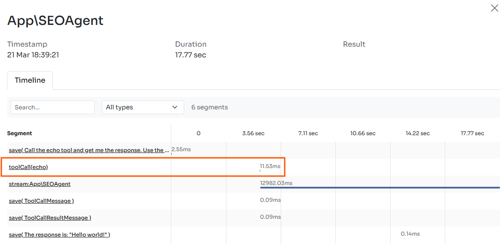

# MCP Connector

MCP (Model Context Protocol) is an open source standard designed by Anthropic to connect your agents to external service providers, such as your application database or external APIs.

Thanks to this protocol you can make tools exposed by an external server available to your agent.

Companies can build servers to allow developers to connect Agents to their platforms. Here are a couple of directories with most used MCP servers:

* MCP official GitHub - [https://github.com/modelcontextprotocol/servers](https://github.com/modelcontextprotocol/servers)
* MCP-GET registry - [https://mcp-get.com/](https://mcp-get.com/)

Once you have one or more MCP server on your machine, you can make their tools available to your agent.

```php
namespace App\Neuron;

use NeuronAI\Agent;
use NeuronAI\Providers\Anthropic\Anthropic;
use NeuronAI\MCP\McpConnector;

class MyAgent extends Agent 
{
    protected function provider()
    {
        return new Anthropic(...);
    }
    
    public function instructions(): string
    {
        return (string) new SystemPrompt(["<SYSTEM PROMPT>"]);
    }
    
    protected function tools()
    {
        return [
            ...McpConnector::make([
                'command' => 'npx',
                'args' => ['-y', '@modelcontextprotocol/server-everything'],
            ])->tools(),
            
            
            ...McpConnector::make([
                'command' => 'php',
                'args' => ['/home/code/mcp_server.php'],
            ])->tools(),
        ];
    }
}
```

You should create an `McpConnector` instance for each MCP server you want to interact to.&#x20;

Neuron automatically discovers the tools exposed by the server and connects them to your agent.

When the agent decides to run a tool, Neuron will generate the appropriate request to call the tool on the MCP servers and return the result to the LLM to continue the task.  It feels exactly like with your own defined tools, but you can access a huge archive of predefined actions your agent can perform with just one line of code.

### Monitoring

To stay updated about your Agent decision making process, you can connect the [Inspector monitoring dashboard](https://inspector.dev/) to monitor tool selection and execution in real-time.

After you sign up at the link above, make sure to set the `INSPECTOR_INGESTION_KEY` variable in the application environment file to start monitoring:


```
INSPECTOR_INGESTION_KEY=nwse877auxxxxxxxxxxxxxxxxxxxxxxxxxxxx
```


When your agent runs you will be able to explore the execution timeline in the dashboard.

<figure><figcaption></figcaption></figure>

### Filter the list of tools

During connection with complex MCP servers they can includes tools that could lead to undesired behavior in specific contexts. The `exclude()` and `only()` methods address this challenge elegantly, allowing developers to connect with comprehensive MCP servers while maintaining fine-grained control over available capabilities you want to provide to your agent.&#x20;

This becomes particularly useful when working with specialized agents that need specific capabilities but you want to reduce the probability of an agent mistake, and reduce tokens consumption.

These methods accept a list of tool names that you do or do not want to associate with the agent.

```php
namespace App\Neuron;

use NeuronAI\Agent;
use NeuronAI\Providers\Anthropic\Anthropic;
use NeuronAI\MCP\McpConnector;

class MyAgent extends Agent 
{
    protected function provider()
    {
        return new Anthropic(...);
    }
    
    public function instructions(): string
    {
        return new SystemPrompt(["<SYSTEM PROMPT>"]);
    }
    
    protected function tools()
    {
        return [
            // EXCLUDE: discard certain tools
            ...McpConnector::make([
                'command' => 'npx',
                'args' => ['-y', '@modelcontextprotocol/server-everything'],
            ])->exclude([
                'tool_name_1',
                'tool_name_2',
                ...
            ])->tools(),
            
            // ONLY: Select the tools you want to include
            ...McpConnector::make([
                'command' => 'npx',
                'args' => ['-y', '@modelcontextprotocol/server-everything'],
            ])->only([
                'tool_name_1',
                'tool_name_2',
                ...
            ])->tools(),
        ];
    }
}
```
