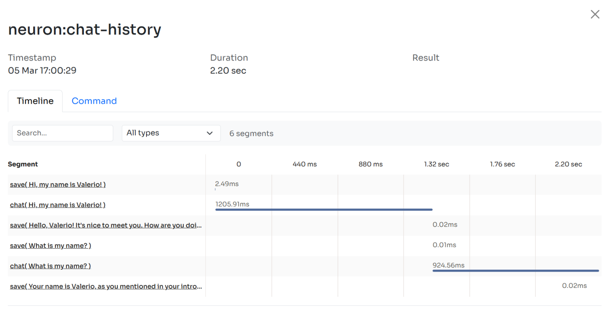

# Logging & Monitoring

### The Problem With AI Systems

Integrating AI Agents into your application you’re not working only with functions and deterministic code, you program your agent also influencing probability distributions. Same input ≠ output. That means reproducibility, versioning, and debugging become real problems.

Many of the Agents you build with NeuronAI will contain multiple steps with multiple invocations of LLM calls, tool usage, access to external memories, etc. As these applications get more and more complex, it becomes crucial to be able to inspect what exactly your agent is doing and why.&#x20;

Why is the model taking certain decisions? What data is the model reacting to? Prompting is not programming in the common sense. No static types, small changes break output, long prompts cost latency, and no two models behave exactly the same with the same prompt.

The [Inspector](https://inspector.dev/) team designed NeuronAI with built-in observability features, so you can monitor AI agents were running, helping you maintain production-grade implementations with confidence.

## Get Started With Inspector

To start monitoring your Agents you just have the `INSPECTOR_INGESTION_KEY` variable in your application environment file.&#x20;


```
INSPECTOR_INGESTION_KEY=nwse877auxxxxxxxxxxxxxxxxxxxxxxxxxxxx
```


When your agents are being executed, you will see the details of their internal steps on the Inspector dashboard.

<figure><figcaption></figcaption></figure>

If you want to monitor the whole application you can install the Inspector package based on your development environment. We provide integration packages for [PHP](https://github.com/inspector-apm/inspector-php), [Laravel](https://github.com/inspector-apm/inspector-laravel), [Symfony](https://github.com/inspector-apm/inspector-symfony), [CodeIgniter](https://github.com/inspector-apm/inspector-codeigniter), [Drupal](https://docs.inspector.dev/guides/drupal). Check out our GitHub organizations: [https://github.com/inspector-apm](https://github.com/inspector-apm).

### Create An Ingestion Key

To create an Ingestion key head to the [**Inspector dashboard**](https://app.inspector.dev/register) and create a new app.


For any additional support drop in a live chat in the dashboard. We are happy to listen from your experience, find new possible improvements, and make the tool better overtime.

