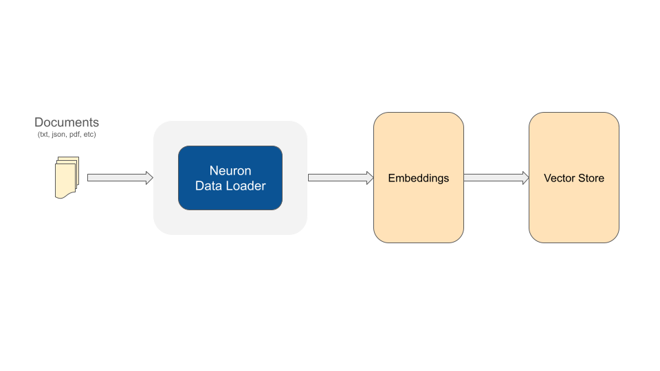

# Data loader


PREREQUISITES

This guide assumes you are already familiar with RAG. Check out the dedicated documentation: [https://docs.neuron-ai.dev/rag](https://docs.neuron-ai.dev/rag)


To build a structured AI application you need the ability to convert all the information you have into text, so you can generate embeddings, save them into a vector store, and then feed your Agent to answer the user's questions.

<figure><figcaption></figcaption></figure>

Neuron gives you several tools (data loaders) to simplify this process.&#x20;

```php
use App\Neuron\MyRAG;
use NeuronAI\RAG\DataLoader\FileDataLoader;

MyRAG::make()->addDocuments(
    // Use the file data loader component to process a text file
    FileDataLoader::for(__DIR__.'/my-article.md')->getDocuments()
);
```

Using the Neuron toolkit you can create data loading pipelines with the benefits of unified interfaces to facilitate interactions between components, like embedding providers, vector store, and file readers.

## FileDataLoader

If you need to extract text from files the `FileDataLoader` allows you to process any simple text document.&#x20;

```php
use NeuronAI\RAG\DataLoader\FileDataLoader;

// Read a file and get "documents"
$documents = FileDataLoader::for(__DIR__.'/my-article.md')->getDocuments();

// Pass a directory to process all files
$documents = FileDataLoader::for(__DIR__)->getDocuments();
```

By default FileDataLoader read the content of a file as it is in the file system, but not all file type are ready to be treated as simple text. Neuron provides you with the ReaderInterface and several pre-defined reader components for the most common file formats.

Notice that each file reader is associated to a file extension. So based on the input file extension the data loader will automatically use the appropriate reader.

### PDF Reader


To use `PdfReader` you need to install the [**pdftotext**](https://en.wikipedia.org/wiki/Pdftotext) php extension.


```php
use NeuronAI\RAG\DataLoader\FileDataLoader;

// Register the PDF reader
$documents = FileDataLoader::for(__DIR__)
    ->addReader('pdf', new \NeuronAI\RAG\DataLoader\PdfReader())
    ->getDocuments();
```

### HML to Markdown Reader


To use `HtmlReader` you need to install the [**html2text**](https://github.com/mtibben/html2text) composer package.


```php
use NeuronAI\RAG\DataLoader\FileDataLoader;

// Register the PDF reader
$documents = FileDataLoader::for(__DIR__)
    ->addReader(['html', 'xhtml'], new \NeuronAI\RAG\DataLoader\HtmlReader())
    ->getDocuments();
```

### StringDataLoader

If you are already getting text from your database or other sources, you can use the StringDataLoader to convert this text into documents, ready to be embedded and stored by the other Neuron components in the chain:

```php
use App\Neuron\MyRAG;
use NeuronAI\RAG\DataLoader\StringDataLoader;

$contents = [
    // list of strings (text you want to embed)
];

foreach ($contents as $text) {
    $documents = StringDataLoader::for($text)->getDocuments(); 
    
    MyRAG::make()->addDocuments($documents);
}
```

### Document meta-data

After getting the array of documents from a data loader you can eventually attach custom meta-data to the document that will be saved in the vector store along with other document default fields:

```php
$documents = FileDataLoader::for($directory)->getDocuments(); 

foreach($documents as $document) {
    $document->addMetadata('user_id', 1234);
}

MyRAG::make()->addDocuments($documents);
```

Once you have these custom fields in the vector store you can use hybrid search for databases that support this feature.&#x20;


Hybrid search allows you to narrow the scope of a semantic search query against records that match certain criteria on other document fields rather that compare only the vector embeddings. Explore the [Vector Store section](vector-store.md) to know which database support hybrid search.


## Text Splitter

Neuron data loaders get files or text in input and generates an array of `\NeuronAI\RAG\Document` objects. These documents are embeddable units. The original text is split into smaller pieces of text to be converted into embeddings and saved in the vector store.

The logic data loaders use to split a long text into chunks can be customized using different strategies. Neuron has a dedicated component for this purpose called "Splitter", and it can be attached to the data loader based on the strategy you prefer or need:

```php
$documents = FileDataLoader::for($directory)
    ->withSplitter(
        new DelimiterTextSplitter()
    )
    ->getDocuments();
```

### &#x20;DelimiterTextSplitter (default)

This is the default splitter for all data loaders.

```php
$documents = FileDataLoader::for($directory)
    ->withSplitter(
        new DelimiterTextSplitter(
            maxLength: 1000,
            separator: '.',
            wordOverlap: 0
        )
    )
    ->getDocuments();
```

Each of these parameters has an impact on the performance and accuracy of your RAG agent.

#### Max Length

Each chunk will not be longer than this value, and it will be divided into smaller documents eventually. The length can impact the accuracy of embeddings representations. More length your units of text are, the less accurate the embeddings representation will be.

#### Separator

The text is first split into chunks based on a separator. By default the component use the period character. You can eventually customize this separator by using any delimiter for your text.

#### Overlap

Sometimes it could be useful to bring words from the previous and next chunk into a document to increase the semantic connection between adjacent sections of the text. By default no overlap is applied.

### SentenceTextSplitter

Splits text into sentences, groups into word-based chunks, and optionally applies overlap in terms of words.

```php
$documents = FileDataLoader::for($directory)
    ->withSplitter(
        new SentenceTextSplitter(
            maxWords: 200,
            overlapWords: 0
        )
    )
    ->getDocuments();
```

**MaxWords**: maximum number of words per chunk

**OverlapWords**: number of overlapping words between chunks

### Implement Custom Splitters

You can implement a custom splitting logic implementing the `SplitterInterface`:

```php
namespace NeuronAI\RAG\Splitter;

use NeuronAI\RAG\Document;

interface SplitterInterface
{
    /**
     * @return Document[]
     */
    public function splitDocument(Document $document): array;

    /**
     * @param  Document[]  $documents
     * @return Document[]
     */
    public function splitDocuments(array $documents): array;
}
```

You can interact with external service or create your custom logic to split a long text into smaller chunks. Once you have created your custom implementation you can use it in with the data loaders:

```php
class CustomSplitter implements SplitterInterface
{
    public function splitDocument(Document $document): array
    {
        // Your logic here...
    }
    
    public function splitDocuments(array $documents): array
    {
        // Your logic here...
    }
}

// Use the custom splitter into the data loader pipeline
$documents = FileDataLoader::for($directory)
    ->withSplitter(
        new CustomSplitter()
    )
    ->getDocuments();
```

## Reindex Knowledge Source

Reindexing is a hot topic in RAG system design because the practice of breaking text into chunks makes it difficult to update individual pieces of information when the content of the original knowledge changes.

In Neuron The `Document` class is designed to carry some metadata to help you identify the source of each piece of knowledge stored into the vector database, like `sourceType` and `sourceName` fields. Using this information you can easily update the vector store with the updated version of the content from a file previously used as a source of knowledge.


The new version of the file **must have the same path and name** you used originally, otherwise the documents will be added as new ones.


```php
$documents = FileDataLoader::for("/path/to/directory")
    ->withSplitter(
        new SentenceTextSplitter(
            maxWords: 200,
            overlapWords: 0
        )
    )
    ->getDocuments();

// Reindex by sourceType and sourceName
MyRAG::make()->reindexBySource($documents);
```

If `sourceType` and `sourceName` of the Documents are already present into the vector store, they will be deleted and the Documents of the new version will be saved. Other documents will be stored as usual into the vector database.

## Use standalone components

In the examples below we used the RAG agent instance to process the final part of the ingestion pipeline: generate embeddings for document chunks, and store them into jthe vector database.&#x20;

In alternative of take advantage of the RAG agent instance you can use the embedding provider and the vector store as standalone components. Remember that the vector store here must be same connected to the RAG agent.

```php
use App\Neuron\MyRAG;
use NeuronAI\RAG\DataLoader\FileDataLoader;
use NeuronAI\RAG\DataLoader\StringDataLoader;
use NeuronAI\RAG\EmbeddingProvider\OpenAIEmbeddingProvider;
use NeuronAI\RAG\VectorStore\FileVectorStore;

$embedder = new OpenAIEmbeddingProvider(
    key: 'OPENAI_API_KEY',
    model: 'OPENAI_MODEL'
);

$store = new FileVectoreStore(
    directory: __DIR__,
    key: 'demo'
);

// Process files and contents
$documents = FileDataLoader::for(__DIR__.'/documents');
    ->addReader('pdf', new \NeuronAI\RAG\DataLoader\PdfReader())
    ->getDocuments(); 

// Generate embeddings and store documents in the vector database
$store->addDocuments(
    $embedder->embedDocuments($documents)
);

```

With this simple process you can ingest GB of data into your vector store to feed your RAG agent.
