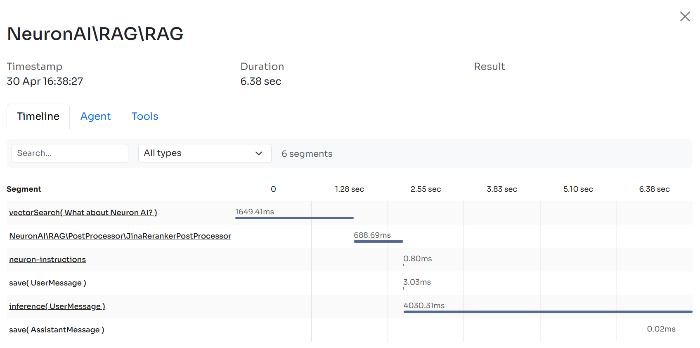

# Pre/Post Processor

As with most software systems, RAG is easy to use but hard to master. The truth is that there is more to RAG than putting documents into a vector DB and adding an LLM on top. That _can work_, but it won't always.

With RAG, you are performing a _semantic search_ across many text documents — these could be tens of thousands up to tens of billions of documents.

To ensure fast search times at scale, we typically use vector search — that is, we transform our text into vectors, place them all into a vector database, and compare their proximity to a query using a similarity algorithm (like cosine similarity).

To achieve high quality responses from the RAG agent you can work on two parts of the retrieval process:&#x20;

1. Optimize the user prompt (_Pre-Processors_)
2. Refine the search results gathered from the vector store (_Post-Processors_)

## Pre-Processors

Rather than treating the user's original query as the final word, the pre-processor views it as the starting point for a more sophisticated interaction with the underlying knowledge system. This isn't about second-guessing the user's intent, but about recognizing that their natural language expression often contains multiple embedded questions, implicit constraints, and contextual assumptions that need to be unpacked and reformulated to maximize retrieval effectiveness.

Consider the complexity hidden within seemingly simple queries. When someone asks "Why did our sales drop last quarter?", they're actually expressing a multi-faceted information need that might require understanding seasonal trends, competitor activities, marketing campaign effectiveness, product performance metrics, and economic indicators. A naive RAG system might retrieve general information about sales analysis, missing the opportunity to provide comprehensive, contextually relevant insights that address the full scope of the underlying question.

### QueryTransformation

The core of this pattern is to use an LLM to transform the original question into a more structured prompts that the main RAG agent can use to perform a more accurate and effective documents retrieval from the vector store.&#x20;

Working with NeuronAI you can pass the instance of the AI provider already attached to your agent:

```php
namespace App\Neuron;

use NeuronAI\RAG\RAG;
use NeuronAI\RAG\PreProcessor\QueryTransformationPreProcessor;
use NeuronAI\RAG\PreProcessor\QueryTransformationType;

class MyChatBot extends RAG
{
    ...

    protected function preProcessors(): array
    {
        return [
            new QueryTransformationPreProcessor(
                provider: $this->resolveProvider(),
                transformation: QueryTransformationType::REWRITING,
            ),
        ];
    }
}
```

Or use a different provider among the supported AI providers like Gemini, Ollama, OpenAI, HuggingFace, etc.

```php
namespace App\Neuron;

use NeuronAI\RAG\RAG;
use NeuronAI\RAG\PreProcessor\QueryTransformationPreProcessor;
use NeuronAI\RAG\PreProcessor\QueryTransformationType;

class MyChatBot extends RAG
{
    ...

    protected function preProcessors(): array
    {
        return [
            new QueryTransformationPreProcessor(
                // Use one of the supported AI Provider
                provider: new Anthropic(
                    key: 'ANTHROPIC_API_KEY',
                    model: 'ANTHROPIC_MODEL',
                ),
                transformation: QueryTransformationType::REWRITING,
            ),
        ];
    }
}
```

The three core strategies implemented in the NeuronAI pre-processor are: rewriting, decomposition, and HyDE (Hypothetical Document Embeddings), each tackle different aspects of this query transformation challenge.

**Query rewriting** addresses the fundamental mismatch between conversational language and search-optimized formulations. When users express their needs in casual, context-dependent language, the rewriting process translates these expressions into more precise, searchable formulations that better align with how information is typically organized and indexed.

**Decomposition** handles the reality that complex questions often contain multiple distinct information needs that would be better served by separate retrieval operations. Rather than forcing a single search to satisfy multiple different aspects of a query, decomposition breaks down complex questions into their constituent parts, allowing each component to be addressed with focused precision before synthesizing the results into a comprehensive response.

T**he HyDE approach** represents perhaps the most sophisticated strategy, working backwards from the assumption that the best way to find relevant information is to first imagine what that information might look like. Instead of searching directly with the user's question, HyDE generates hypothetical documents that would ideally answer the query, then uses these generated documents as the basis for similarity searches. This approach is particularly powerful when dealing with abstract concepts or when the user's terminology doesn't closely match the vocabulary used in the source documents.

## Post-Processors&#x20;

For vector search to work instead, we need vectors. These vectors are essentially compressions of the "meaning" behind some text into (typically) 768 or 1536-dimensional vectors. There is some information loss because we're compressing this information into a single vector.

Because of this information loss, we often see that the top three (for example) vector search documents will miss relevant information. Unfortunately, the retrieval may return relevant information below our `top_k` cutoff.

What do we do if relevant information at a lower position would help our LLM formulate a better response? The easiest approach is to increase the number of documents we're returning (increase `top_k`) and pass them all to the LLM.

Unfortunately, we cannot pass everything to the LLM because this dramatically reduces the LLM's performance to find relevant information from the text placed within its context window.

The solution to this issue is retrieving plenty of documents from the vector store and then _minimizing_ the number of documents that make it to the LLM. To do that, you can reorder and filter retrieved documents to keep just the most relevant for our LLM.

Neuron allows you to define a list of post-processor components to pipe as many transformations you need to optimize the agent output.

### Rerankers

Reranking is one of the most popular post-process operations you can apply to the retrieved documents. A reranking service calculates a similarity score of each documents retrieved from the vector store with the input query.&#x20;

We use this score to reorder the documents by relevance and take only the most useful.

### Jina Reranker

```php
namespace App\Neuron;

use NeuronAI\RAG\RAG;
use NeuronAI\RAG\PostProcessor\JinaRerankerPostProcessor;
use NeuronAI\RAG\VectorStore\FileVectoreStore;
use NeuronAI\RAG\VectorStore\VectorStoreInterface;

class MyChatBot extends RAG
{
    ...
    
    protected function vectorStore(): VectorStoreInterface
    {
        return new FileVectoreStore(
            directory: storage_path(),
            topK: 50
        );
    }

    protected function postProcessors(): array
    {
        return [
            new JinaRerankerPostProcessor(
                key: 'JINA_API_KEY',
                model: 'JINA_MODEL',
                topN: 5
            ),
        ];
    }
}
```

In the example above you can see how the vector store is instructed to get 50 documents, and the reranker will basically take only the 5 most relevant ones.

### Cohere Reranker

```php
namespace App\Neuron;

use NeuronAI\RAG\RAG;
use NeuronAI\RAG\PostProcessor\CohereRerankerPostProcessor;
use NeuronAI\RAG\VectorStore\FileVectoreStore;
use NeuronAI\RAG\VectorStore\VectorStoreInterface;

class MyChatBot extends RAG
{
    ...
    
    protected function vectorStore(): VectorStoreInterface
    {
        return new FileVectoreStore(
            directory: storage_path(),
            topK: 50
        );
    }

    protected function postProcessors(): array
    {
        return [
            new CohereRerankerPostProcessor(
                key: 'COHERE_API_KEY',
                model: 'COHERE_MODEL',
                topN: 3
            ),
        ];
    }
}
```

### Fixed Threshold

It uses a simple, configurable fixed threshold to filter documents. Documents with scores below the threshold are removed from results.

It's ideal for scenarios requiring an explicit score cutoff for fixed quality requirements.

```php
namespace App\Neuron;

use NeuronAI\RAG\PostProcessor\FixedThresholdPostProcessor;

class MyChatBot extends RAG
{
    ...

    protected function postProcessors(): array
    {
        return [
            new FixedThresholdPostProcessor(
                threshold: 0.5
            ),
        ];
    }
}
```

### Adaptive Threshold

It implements a dynamic thresholding algorithm using median and MAD (Median Absolute Deviation). It automatically adjusts to score distributions, making it robust against outliers.

You can configure a multiplier parameter that controls filtering aggressiveness.

Recommended multiplier values:

* \[0.2 to 0.4] High precision mode. For more targeted results with fewer but more relevant documents.
* \[0.5 to 0.7] Balanced mode. Recommended setting for general use cases.
* \[0.8 to 1.0] High recall mode. For more inclusive results that prioritize coverage.
* \>1.0 Not recommended as it tends to include almost all documents.

This component is ideal for cleaning up RAG results with dynamic filtering that adapts to the current result set's score distribution.

```php
namespace App\Neuron;

use NeuronAI\RAG\PostProcessor\AdaptiveThresholdPostProcessor;

class MyChatBot extends RAG
{
    ...

    protected function postProcessors(): array
    {
        return [
            new AdaptiveThresholdPostProcessor(
                multiplier: 0.6
            ),
        ];
    }
}
```

## Monitoring

Neuron built-in observability features automatically trace the execution of each post processor, so you'll be able to monitor interactions with external services in your [Inspector](https://inspector.dev/) account. Learn more in the [monitoring section](../advanced/observability.md).

<figure><figcaption></figcaption></figure>

## Extending The Framework

With Neuron you can easily create your custom post processor components by simply extending the `\NeuronAI\PostProcessor\PostProcessorInterface`:

```php
namespace NeuronAI\RAG\PostProcessor;

use NeuronAI\Chat\Messages\Message;
use NeuronAI\RAG\Document;

interface PostProcessorInterface
{
    /**
     * Process an array of documents and return the processed documents.
     *
     * @param Message $question The question to process the documents for.
     * @param array<Document> $documents The documents to process.
     * @return array<Document> The processed documents.
     */
    public function process(Message $question, array $documents): array;
}
```

Implementing the `process` method you can perform actions on the list of documents and return the new list. Neuron will run the post processors in the same order they are listed in the `postProcessors()` method.

Here is a practical example:

```php
namespace App\Neuron\PostProcessors;

use NeuronAI\Chat\Messages\Message;
use NeuronAI\RAG\PostProcessor\PostProcessorInterface;

// Implement your custom component
class CutOffPostProcessor implements PostProcessorInterface
{
    public function __constructor(protected int $level) {}

    public function process(Message $question, array $documents): array
    {
        /*
         * Apply a cut off on the score returned by the vector store
         */
         
        return $documents;
    }
}
```
