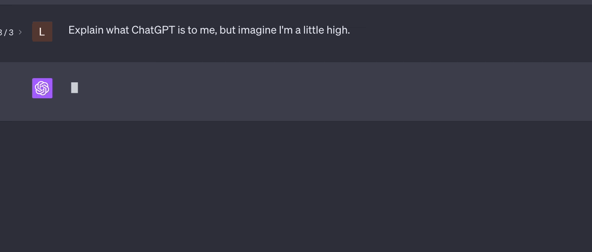

# Streaming

Streaming enables you to show users chunks of response text as they arrive rather than waiting for the full response. You can offer a real-time Agent conversation experience.

<figure><figcaption></figcaption></figure>

### Agent

To stream the AI response you should use the `stream()` method to run the agent, instead of `chat()`. This method return a PHP generator that can be used to process the response as an iterable object.

```php
use App\Neuron\MyAgent;
use NeuronAI\Chat\Messages\UserMessage;

$stream = MyAgent::make()->stream(
    new UserMessage('How are you?')
);

// Print the response chunk-by-chunk in real-time
foreach ($stream as $text) {
    echo $text;
}

// I'm fine, thank you! How can I assist you today?
```

### Streaming & Tools

Neuron support Tools & Function calls in combination with the streaming response. You are free to provide your Agents with Tools and they will be automatically handled in the middle of the stream, to continue toward the final response.

```php
use App\Neuron\MyAgent;
use NeuronAI\Chat\Messages\UserMessage;
use NeuronAI\Tools\Tool;

$stream = MyAgent::make()
    ->addTool(
        Tool::make(
            'get_server_configuration',
            'retrieve the server network configuration'
        )->addProperty(...)->setCallable(...)
    )
    ->stream(
        new UserMessage("What's the IP address of the server?")
    );

// Print the response chunk-by-chunk in real-time
foreach ($stream as $text) {
    echo $text;
}

// Let me retrieve the server configuration. 
// The IP address of the server is: 192.168.0.10
```

### Monitoring

To watch inside this workflow you should connect your Agent to the [Inspector monitoring dashboard](https://inspector.dev/) in order to see the tool call execution flow in real-time.

After you sign up at the link above, make sure to set the `INSPECTOR_INGESTION_KEY` variable in the application environment file to start monitoring:


```
INSPECTOR_INGESTION_KEY=nwse877auxxxxxxxxxxxxxxxxxxxxxxxxxxxx
```


<figure><figcaption></figcaption></figure>


Learn more about Agent observability in the [dedicated documentation](../advanced/observability.md).

