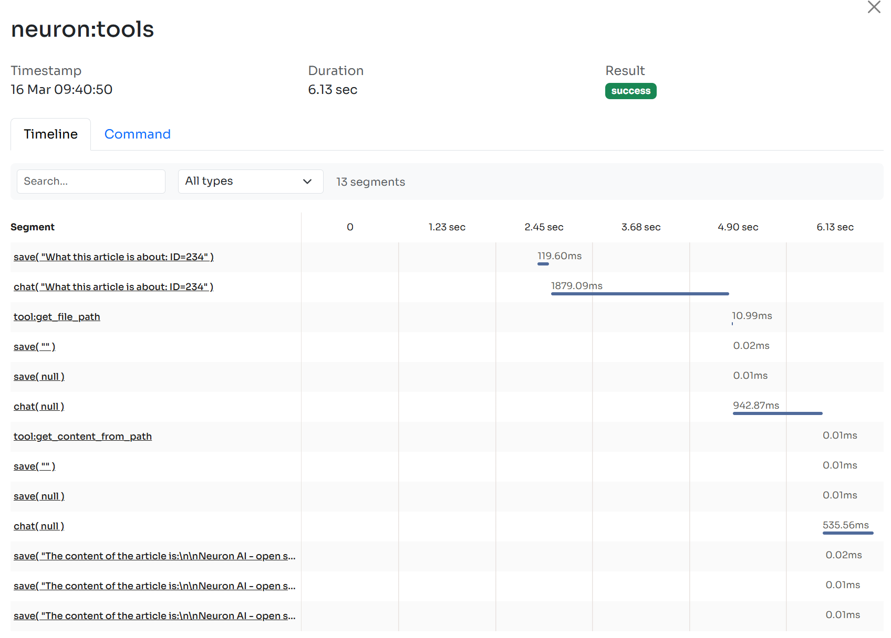
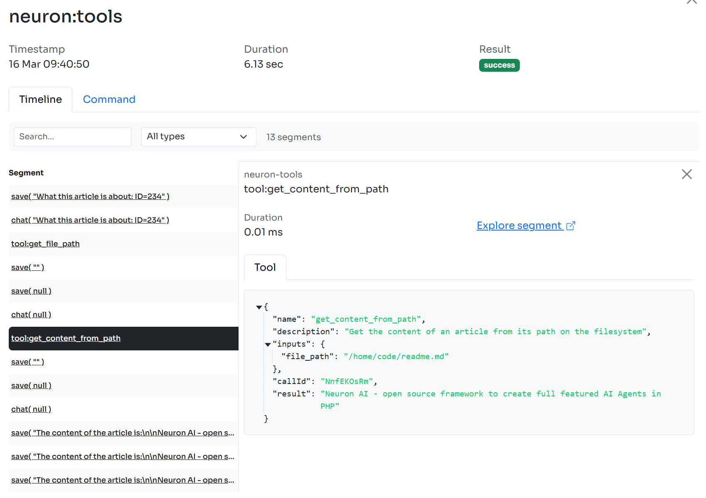
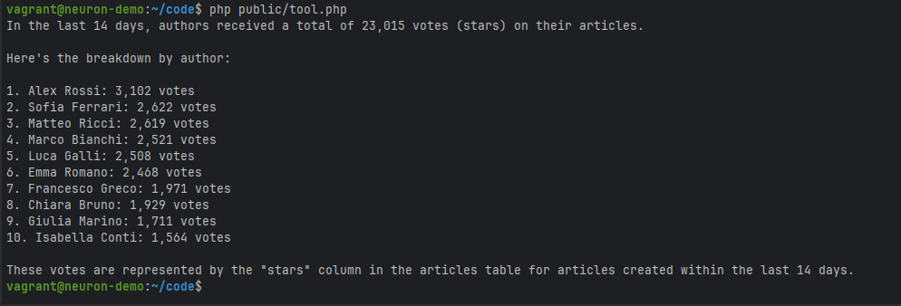

# Tools

Tools enable Agents to go beyond generating text by facilitating interaction with your application services, or external APIs.

Think about Tools as special functions that your AI agent can use when it needs to perform specific tasks. They let you extend your Agent's capabilities by giving it access to specific functions it can call inside your code.



In the [YouTubeAgent](agent.md) example we can define a tool to make the Agent able to retrieve the YouTube video transcription, so it can crteate a short summary:

```php
namespace App\Neuron;

use NeuronAI\Agent;
use NeuronAI\SystemPrompt;
use NeuronAI\Providers\AIProviderInterface;
use NeuronAI\Providers\Anthropic\Anthropic;
use NeuronAI\Tools\PropertyType;
use NeuronAI\Tools\Tool;
use NeuronAI\Tools\ToolProperty;

class YouTubeAgent extends Agent
{
    protected function provider(): AIProviderInterface
    {
        // return an AI provider instance (Anthropic, OpenAI, Ollama, Gemini, etc.)
        return new Anthropic(
            key: 'ANTHROPIC_API_KEY',
            model: 'ANTHROPIC_MODEL',
        );
    }
    
    public function instructions(): string 
    {
        return new SystemPrompt(
            background: ["You are an AI Agent specialized in writing YouTube video summaries."],
            steps: [
                "Get the url of a YouTube video, or ask the user to provide one.",
                "Use the tools you have available to retrieve the transcription of the video.",
                "Write the summary.",
            ],
            output: [
                "Write a summary in a paragraph without using lists. Use just fluent text.",
                "After the summary add a list of three sentences as the three most important take away from the video.",
            ]
        );
    }
    
    protected function tools(): array
    {
        return [
            Tool::make(
                'get_transcription',
                'Retrieve the transcription of a youtube video.',
            )->addProperty(
                new ToolProperty(
                    name: 'video_url',
                    type: PropertyType::STRING
                    description: 'The URL of the YouTube video.',
                    required: true
                )
            )->setCallable(function (string $video_url) {
                return "Video transcripton...";
            })
        ];
    }
}

```

Let’s break down the code.

We introduced the new method `tools()` into the Agent class. This method expects to return an array of Tool objects that the AI will be able to use if needed.

In this example we return an array of just one tool, named `get_transcription`.&#x20;

Notice that the `ToolProperty` we define should match with the signature of the function you use as a callable. The callable gets the `$video_url` arguments, and the name of the property is exactly "video\_url".

The most important thing are the name and description you give to the tool and its properties. All these pieces of information will be passed to the LLM in natural language. The more explicit and clear you are, the more likely the LLM understands when, if, and why, it’s the case to use the tool.

Once the Agent decides to use a tool the callable function is executed. Here we can implement the logic to retrieve the video transcription and return the information back to the LLM.

Neuron provides you with these clear and simple APIs and automates all the underlying interactions with the LLM. Once you get the point it can immediately open to a possibility to connect basically everything you want to the Agent. Being able to execute local functions allows you to invoke any external APIs or application components.

## Implement Custom Tools

Thanks to the NeuronAI modular architecture, Tools are just a component of the toolkit that rely on the `ToolInterface` interface. You are free to create pre-packaged tool classes that implements common functionalities, and release them as external composer packages or submit a PR to our repository to have them integrated into the core framework.

To create a new Tool you can extend the `NeuronAI\Tools\Tool` class. The most important elements of a tool are:

**Tool name and description**: Define name and description of the tool in the tool constructor. Invest in prompt engineering to help the model take better decisions.

**The properties method**: Implement this method to return the list of properties the tool expect.

**The \_\_invoke method**: Here you need to implement the logic of the tool, and return a result that will be returned back to the model. The PHP `__invoke` magic method is used by default.

```php
<?php

namespace App\Neuron\Tools;

use GuzzleHttp\Client;
use NeuronAI\Tools\PropertyType;
use NeuronAI\Tools\Tool;
use NeuronAI\Tools\ToolProperty;

class GetTranscriptionTool extends Tool
{
    protected Client $client;
    
    public function __construct(protected string $key)
    {
        // Define Tool name and description
        parent::__construct(
            'get_transcription',
            'Retrieve the transcription of a youtube video.',
        );
    }
    
    /**
     * Return the list of the properties.
     */
    protected function properties(): array
    {
        return [
            new ToolProperty(
                name: 'video_url',
                type: PropertyType::STRING,
                description: 'The URL of the YouTube video.',
                required: true
            )
        ];
    }
    
    /**
     * Implementing the tool logic in the __invoke magic method.
     */
    public function __invoke(string $video_url)
    {
        $response = $this->getClient()->get('transcript?url=' . $video_url.'&text=true');

        if ($response->getStatusCode() !== 200) {
            return "Transcription APIs error: {$response->getBody()->getContents()}";
        }

        $response = json_decode($response->getBody()->getContents(), true);

        return $response['content'];
    }
    
    protected function getClient(): Client
    {
        if (isset($this->client)) {
            return $this->client;
        }
        
        return $this->client = new Client([
            'base_uri' => 'https://api.supadata.ai/v1/youtube/',
            'headers' => [
                'x-api-key' => $this->key,
            ]
        ]);
    }
}
```

Notice how the `__invoke()` method accepts the same arguments defined by the `ToolProperty` . In this example I'm using an external service to retrieve the YouTube video transcription called [Supadata.ai](https://supadata.ai/).

You can attach the tool in the agent class as usual:

```php
<?php

namespace App\Neuron;

use NeuronAI\Agent;
use NeuronAI\Providers\AIProviderInterface;
use NeuronAI\Providers\Anthropic\Anthropic;
use NeuronAI\SystemPrompt;
use App\Neuron\Tools\MyCustomTool;

class YouTubeAgent extends Agent
{
    public function provider(): AIProviderInterface
    {
        // return an AI provider instance (Gemini, OpenAI, Ollama, etc.)
        return new Anthropic(
            key: 'ANTHROPIC_API_KEY',
            model: 'ANTHROPIC_MODEL',
        );
    }
    
    public function instructions() 
    {
        return new SystemPrompt(...);
    }
    
    public function tools(): array
    {
        return [
            GetTranscriptionTool::make(key: 'API_KEY'),
        ];
    }
}
```

Transcriptions are just an example. You can eventually implement other tools to make the Agent able to retrieve other video metadata to enhance its video analysis capabilities.

Finally you can talk to the agent asking the summary of a YouTube video.

```php
use NeuronAI\Chat\Messages\UserMessage;

$response = YouTubeAgent::make($user)->chat(
    new UserMessage('What about this video: https://www.youtube.com/watch?v=WmVLcj-XKnM')
);
    
echo $response->getContent();

/**

Based on the transcription, I'll provide a summary of this powerful environmental 
message from "Mother Nature":
This video presents ...

Three most important takeaways:

1. Nature has existed ...

2. The wellbeing of humanity is ...

3. How humans choose to act toward Nature determines ...

*/
```

## Monitoring

When you provide the Agent with tools, Neuron sends their information to the LLM along with the user message.

Once the LLM reads the prompt and the information of the tools attached, it will decide if some tool can help to gather additional information to respond to the user prompt. In that case it will return a special response that contains the tools the LLM wants to call.

Neuron automatically manages this response for you, executing the callable of the tools the LLM decided to call, and return the result back to the LLM to get its final response.

<figure><figcaption></figcaption></figure>

To watch inside this workflow you should connect your Agent to the [Inspector monitoring dashboard](https://inspector.dev/) in order to see the tool call execution flow in real-time.

After you sign up at the link above, make sure to set the `INSPECTOR_INGESTION_KEY` variable in the application environment file to start monitoring:


```
INSPECTOR_INGESTION_KEY=nwse877auxxxxxxxxxxxxxxxxxxxxxxxxxxxx
```


<figure><figcaption></figcaption></figure>

In the image below you can see all the details about the execution of the tool to retrieve the transcription of the video:

<figure><figcaption></figcaption></figure>

## Define Tool Properties

Neuron allows you to define the format of the data you want to receive into the tool function. You can nest these objects inside each other to define complex data structures.


Be careful when defining complex data structures. Even the more advanced models can make mistakes with just a couple of properties. We strongly recommend to keep the input properties of your tools as simple as possible to improve reliability of your agent.


### ToolProperty

This class represent a simple scalar value like string, int, or boolean.

```php
namespace App\Neuron\Tools;

use NeuronAI\Tools\PropertyType;
use NeuronAI\Tools\Tool;
use NeuronAI\Tools\ToolProperty;

class MyTool extends Tool
{
    public function __construct(){...}
	
    protected function properties(): array
    {
        return [
            new ToolProperty(
                name: 'arg',
                type: PropertyType::STRING,
                description: 'Describe the value you expect',
                required: true
            )
        ];
    }
    
    public function __invoke(string $arg){...}
}
```

### ArrayProperty

The `ArrayProperty` allows you to require a list of items with specific characteristics.

Use the argument `items` to specify the data type of the array elements. In the example below we ask for an array of string.

```php
namespace App\Neuron\Tools;

use NeuronAI\Tools\PropertyType;
use NeuronAI\Tools\Tool;
use NeuronAI\Tools\ArrayProperty;
use NeuronAI\Tools\ToolProperty;

class MyTool extends Tool
{
    public function __construct(){...}
	
    protected function properties(): array
    {
        return [
            new ArrayProperty(
                name: 'prop_array',
                description: 'Describe the value you expect',
                required: true,
                items: new ToolProperty(
                    name: 'prop',
                    type: PropertyType::STRING,
                    description: 'Describe the value you expect',
                    required: true
                )
            )
        ];
    }
    
    public function __invoke(string $arg){...}
}
```

#### Max and Min limits

The ArrayProperty allows you also to define limitations about the size of the expected array using `minItems` and `maxItems` arguments.

```php
$property = new ArrayProperty(
    name: "tags",
    description: "List of tags associated with the item",
    required: true,
    items: new ToolProperty(
        name: "tag",
        type: PropertyType::STRING,
        description: "A single tag",
        required: true
    ),
    minItems: 1,
    maxItems: 10
);
```

### ObjectProperty

Similar to the array example above you can define an object data structure:

```php
namespace App\Neuron\Tools;

use NeuronAI\Tools\PropertyType;
use NeuronAI\Tools\Tool;
use NeuronAI\Tools\ObjectProperty;
use NeuronAI\Tools\ToolProperty;

class MyTool extends Tool
{
    public function __construct(){...}
	
    protected function properties(): array
    {
        return [
            new ObjectProperty(
                name: 'colors',
                description: 'RGB color',
                required: true,
                properties: [
                    new ToolProperty(
                        name: 'r',
                        type: PropertyType::NUMBER,
                        description: 'The red part of the RGB',
                        required: true
                    ),
                    new ToolProperty(
                        name: 'g',
                        type: PropertyType::NUMBER,
                        description: 'The green part of the RGB',
                        required: true
                    ),
                    new ToolProperty(
                        name: 'b',
                        type: PropertyType::NUMBER,
                        description: 'The blue part of the RGB',
                        required: true
                    )
                ]
            )
        ];
    }
    
    public function __invoke(string $arg){...}
}
```

### Structured Tool Input

If the obect you want has many properties you can pass a structured PHP class to the `ObjectProperty` instead of defining the schema manually. Neuron will provide you with an instance of this class as the input argument of the tool function:

```php
namespace App\Neuron\Tools;

use App\Neuron\Dto\Color;
use NeuronAI\Tools\PropertyType;
use NeuronAI\Tools\Tool;
use NeuronAI\Tools\ToolProperty;

class MyTool extends Tool
{
    public function __construct(){...}
	
    protected function properties(): array
    {
        return [
            new ObjectProperty(
                name: 'color',
                description: 'Combination of colors',
                required: true,
                class: Color::class
            )
        ];
    }
    
    public function __invoke(Color $color){...}
}
```

Here is how the Colors class looks like:

```php
<?php

namespace App\Neuron\Dto;

use NeuronAI\StructuredOutput\SchemaProperty;

class Color
{
    #[SchemaProperty(description: "The RED part of the RGB", required: true)]
    public float $r;
    
    #[SchemaProperty(description: "The GREEN part of the RGB", required: true)]
    public float $g;
    
    #[SchemaProperty(description: "The BLUE part of the RGB", required: true)]
    public float $b;
}
```

## Toolkits: Composable Agent Capabilities

The philosophy behind Neuron's toolkit system emerged from a fundamental observation during AI Agent Development: while individual tools provide specific capabilities, real-world AI agents often require coordinated sets of related functionalities.&#x20;

Rather than forcing developers to manually assemble collections of tools for common use cases, Neuron introduces toolkits as an abstraction layer that transforms how we think about agent capability composition.

The traditional approach requires instantiating each tool individually. Imagine you want to build agents that need mathematical reasoning – addition, subtraction, multiplication, division, and exponentiation tools must all be declared separately in the agent's tool configuration. This granular approach quickly becomes unwieldy when agents require comprehensive functionality sets.&#x20;

Toolkits represents Neuron's solution to this complexity, packaging tools created aroud the same scope into a single, coherent interface that can be attached to any agent with a single line of code.

Here is an example of the `CalculatorToolkit`:

```php
namespace NeuronAI\Tools\Toolkits\Calculator;

use NeuronAI\Tools\Toolkits\AbstractToolkit;

class CalculatorToolkit extends AbstractToolkit
{
    public function guidelines(): ?string
    {
        return "This toolkit allows you to perform mathematical operations. You can also use this functions to solve
        mathematical expressions executing smaller operations step by step to calculate the final result.";
    }

    public function provide(): array
    {
        return [
            SumTool::make(),
            SubtractTool::make(),
            MultiplyTool::make(),
            DivideTool::make(),
            ExponentiateTool::make(),
        ];
    }
}
```

The `AbstractToolkit` base class establishes a consistent interface that all toolkits inherit, ensuring predictable behavior across the framework.

The `guidelines()` method serves a particularly important function in agent development – it provides contextual information that helps the underlying language model understand not just what tools are available, but how they should be used together. In the case of the `CalculatorToolkit`, the guidelines explicitly suggest that complex mathematical expressions can be solved through step-by-step operations, guiding the agent toward effective problem-solving strategies.

The `provide()` method returns the array of tools included in the toolkit by default. When a toolkit is attached to an agent, the individual tools become available exactly as if they had been added separately, but without the cognitive overhead of managing multiple tool declarations. Here is how you can add it to your agent:

```php
<?php

namesoace App\Neuron;

use NeuronAI\Agent;
use NeuronAI\Tools\Calculator\CalculatorToolkit;

class MyAgent extens Agent
{
    ...
	
    public function tools(): array
    {
        return [
            CalculatorToolkit::make(),
        ];
    }
}
```

During development of complex agents, I've frequently encountered scenarios where a toolkit provides mostly the right functionality but includes tools that could lead to undesired behavior in specific contexts. The `exclude()` method addresses this challenge elegantly, allowing developers to attach comprehensive toolkits while maintaining fine-grained control over available capabilities. This becomes particularly useful when working with specialized agents that need specific capabilities but you want to reduce the probability of an agent mistake, and reduce tokens consumption.

```php
<?php

namespace App\Neuron;

use NeuronAI\Agent;
use NeuronAI\Tools\Calculator\CalculatorToolkit;
use NeuronAI\Tools\Toolkits\Calculator\DivideTool;
use NeuronAI\Tools\Toolkits\Calculator\ExponentiateTool;
use NeuronAI\Tools\Toolkits\Calculator\MultiplyTool;

class MyAgent extens Agent
{
    ...
	
    public function tools(): array
    {
    	return [
            CalculatorToolkit::make()->exclude([
                DivideTool::class,
                ExponentiateTool::class,
                MultiplyTool::class,
            ]),
	];
    }
}
```

The exclusion mechanism operates at the class level, using fully qualified class names to identify tools for removal. In the same way you can also use the mthod `only()` to request a sub-set of the available tools in the toolkit.

```php
<?php

namespace App\Neuron;

use NeuronAI\Agent;
use NeuronAI\Tools\Calculator\CalculatorToolkit;
use NeuronAI\Tools\Toolkits\Calculator\MedianTool;
use NeuronAI\Tools\Toolkits\Calculator\StandardDeviationTool;

class MyAgent extens Agent
{
    ...
	
    public function tools(): array
    {
    	return [
            CalculatorToolkit::make()->only([
                StandardDeviationTool::class,
                MedianTool::class,
            ]),
	];
    }
}
```

From an extensibility perspective, the toolkit system opens remarkable opportunities for community contribution and ecosystem growth. The consistent interface means that third-party developers can create domain-specific toolkits that integrate seamlessly with Neuron's architecture. A developer building agents for financial applications might create a FinancialToolkit that includes tools for currency conversion, interest calculation, and risk assessment. Similarly, a WebScrapingToolkit could package HTTP request tools, HTML parsing capabilities, and data extraction utilities into a single, reusable component.

## Available Toolkits

Neuron ships with several built-in tools and toolkits that allows you to quickly equip your agents with many skills. You can use these tools individually or attach entire toolkits with a single line of code.

### Calculator

The CalculatorToolkit provides a comprehensive suite of computational tools designed to make your AI agents performs accurate calculations. It can seamlessly integrates with complementary toolkits that provide data access—such as database connectors, CSV processors, API clients, or spreadsheet readers—enabling AI agents to perform sophisticated statistical calculations, and deliver comprehensive insights in response to complex business queries.

```php
<?php

namespace App\Neuron;

use NeuronAI\Agent;
use NeuronAI\Tools\Toolkits\Calculator\CalculatorToolkit;

class MyAgent extends Agent
{
    ...
    
    protected function tools(): array
    {
        return [
            CalculatorToolkit::make(),
        ];
    }
}
```

| sum                | SumTool::make()               |
| ------------------ | ----------------------------- |
| subtract           | SubtractTool::make()          |
| multiply           | MultiplyTool::make()          |
| divide             | DivideTool::make()            |
| exponential        | ExponentialTool::make()       |
| square root        | SquareRootTool::make()        |
| nth root           | NthRootTool::make()           |
| mean               | MeanTool::make()              |
| median             | MedianTool::make()            |
| mode               | ModeTool::make()              |
| standard deviation | StandardDeviationTool::make() |
| variance           | VarianceTool::make()          |

### MySQL & PostgreSQL

These toolkits make your agent able to interact with your database. If you ask "How many votes did the authors get in the last 14 days?", the agent doesn’t guess or hallucinate an answer. Instead, it recognizes that this question requires database access, identifies the appropriate tables involved and retrieves real data from your system.

<figure><figcaption></figcaption></figure>

All the tools in the MySQL and PostgreSQL toolkits require a [PDO](https://www.php.net/manual/en/class.pdo.php) instance as a constructor argument. If you are in a framework environment or you are already using an ORM in general, you can gather the underlying PDO instance from the ORM and pass it to the tools. You can learn more about this implementation strategy in this in-depth article: [https://inspector.dev/mysql-ai-toolkit-bringing-intelligence-to-your-database-layer-in-php/](https://inspector.dev/mysql-ai-toolkit-bringing-intelligence-to-your-database-layer-in-php/)

The PDO instance is basically a connection to a specific database, so you could aslo think to create dedicated credentials for your agent. It could be helpful to control the level of access your agent has to the database.&#x20;

Anyway you have separate tools for reading and writing to the database. If you are not confident about your agent behaviour you may not provide the writing tool.


Examples below refer to the `MySQLToolkit` but it's exactly the same using `PGSQLToolkit` and indivudual tools.


```php
<?php

namespace App\Neuron;

use NeuronAI\Agent;
use NeuronAI\Tools\Toolkits\MySQL\MySQLToolkit;
use NeuronAI\Tools\Toolkits\MySQL\PGSQLToolkit;

class MyAgent extends Agent
{
    ...
    
    protected function tools(): array
    {
        return [
            // Connect to a MySQL database
            MySQLToolkit::make(
                new \PDO("mysql:host=localhost;dbname=DB_NAME;charset=utf8mb4", "DB_USER", "DB_PASS"),
            ),
            
            // or Postgre database
            PGSQLToolkit::make(
                new \PDO("pgsql:host=localhost;dbname=DB_NAME;charset=utf8mb4", "DB_USER", "DB_PASS"),
            ),
        ];
    }
}
```

#### MySQLSchemaTool / PGSQLSchemaTool

This tool allows agents to understand the structure of your database, enabling them to construct intelligent queries without requiring you to hardcode table structures or relationships into prompts. This tool essentially gives your agent the equivalent of a database administrator’s understanding of your schema, allowing it to craft queries that respect your data model and take advantage of existing indexes and relationships.

```php
namespace App\Neuron;

use NeuronAI\Agent;
use NeuronAI\Tools\Toolkits\MySQL\MySQLSchemaTool;

class MyAgent extends Agent
{
    ...
    
    protected function tools(): array
    {
        return [
            MySQLSchemaTool::make(new \PDO(...)),
            
            // PGSQLSchemaTool::make(new \PDO(...)),
        ];
    }
}
```

This tool also accept a second argument `$tables`. You can basically pass a list of tables that you want to include in the schema information passed to the LLM. This is basically a way to limit the scope of the queries the agent will later execute on the database.

```php
namespace App\Neuron;

use NeuronAI\Agent;
use NeuronAI\Tools\Toolkits\MySQL\MySQLSchemaTool;

class MyAgent extends Agent
{
    ...
    
    protected function tools(): array
    {
        return [
            MySQLSchemaTool::make(
                new \PDO(...),
                ['users', 'categories', 'articles', 'tags']
            ),
        ];
    }
}
```

By limiting the schema scope, you can create specialized agents that focus on specific areas of your application. A content management agent might only need access to articles, categories, and tags, while a user administration agent requires visibility into users, roles, and permissions tables. This approach not only improves performance but also reduces the cognitive load on the language model, leading to more accurate and focused responses.

#### MySQLSelectTool / PGSQLSelectTool

Use this tool to make your agent able to run SELECT query against the database.

```php
namespace App\Neuron;

use NeuronAI\Agent;
use NeuronAI\Tools\Toolkits\MySQL\MySQLSchemaTool;
use NeuronAI\Tools\Toolkits\MySQL\MySQLSelectTool;

class MyAgent extends Agent
{
    ...
    
    protected function tools(): array
    {
        return [
            MySQLSchemaTool::make(new \PDO(...)),
            MySQLSelectTool::make(new \PDO(...)),
        ];
    }
}
```

#### MySQLWriteTool / PGSQLWriteTool

Use this tool to make your agent able to performs write operations against the database (INSERT, UPDATE, DELETE).

<pre class="language-php"><code class="lang-php"><strong>namespace App\Neuron;
</strong>
use NeuronAI\Agent;
use NeuronAI\Tools\Toolkits\MySQL\MySQLSchemaTool;
use NeuronAI\Tools\Toolkits\MySQL\MySQLWriteTool;

class MyAgent extends Agent
{
    ...
    
    protected function tools(): array
    {
        return [
            MySQLSchemaTool::make(new \PDO(...)),
            MySQLWriteTool::make(new \PDO(...)),
        ];
    }
}
</code></pre>

### Tavily&#x20;

This toolkit enable your agent to performs web search, page content extraction, and crawling.

```php
namespace App\Neuron;

use NeuronAI\Agent;
use NeuronAI\Tools\Toolkits\Tavily\TavilyToolkit;

class MyAgent extends Agent
{
    ...
    
    protected function tools(): array
    {
        return [
            TavilyToolkit::make(
                key: 'TAVILY_API_KEY'
            ),
        ];
    }
}
```

#### Tavily Web Search

It makes your Agent able to search the web. It requires access to [Tavily APIs](https://tavily.com/).

```php
namespace App\Neuron;

use NeuronAI\Agent;
use NeuronAI\Tools\Toolkits\Tavily\TavilySearchTool;

class MyAgent extends Agent
{
    ...
    
    protected function tools(): array
    {
        return [
            TavilySearchTool::make(
                key: 'TAVILY_API_KEY'
            ),
        ];
    }
}
```

You can customize the default options to retrieve search results by passing your preference in the `withOptions` method:

```php
TavilySearchTool::make(
    key: 'TAVILY_API_KEY'
)->withOptions([
    'days' => 30,
    'max_results' => 10,
]),
```

#### Tavily Extract

Extract web page content from an URL. It requires access to [Tavily APIs](https://tavily.com/).

```php
namespace App\Neuron;

use NeuronAI\Agent;
use NeuronAI\Tools\Toolkits\Tavily\TavilyExtractTool;

class MyAgent extends Agent
{
    ...
    
    protected function tools(): array
    {
        return [
            TavilyExtractTool::make(
                key: 'TAVILY_API_KEY'
            ),
        ];
    }
}
```

#### Tavily Crawl

Tavily Crawl is a graph-based website traversal tool that can explore hundreds of paths in parallel with built-in extraction and intelligent discovery.

```php
namespace App\Neuron;

use NeuronAI\Agent;
use NeuronAI\Tools\Toolkits\Tavily\TavilyCrawlTool;

class MyAgent extends Agent
{
    ...
    
    protected function tools(): array
    {
        return [
            TavilyCrawlTool::make(
                key: 'TAVILY_API_KEY'
            ),
        ];
    }
}
```

### Jina&#x20;

This toolkit enable your agent to performs web search, and read the content of a specific URL.

```php
namespace App\Neuron;

use NeuronAI\Agent;
use NeuronAI\Tools\Toolkits\Jina\JinaToolkit;

class MyAgent extends Agent
{
    ...
    
    protected function tools(): array
    {
        return [
            JinaToolkit::make(
                key: 'JINA_API_KEY'
            ),
        ];
    }
}
```

#### Jina Web Search

It makes your Agent able to search the web. It requires access to [Jina API](https://jina.ai/).

```php
namespace App\Neuron;

use NeuronAI\Agent;
use NeuronAI\Tools\Toolkits\Jina\JinaWebSearch;

class MyAgent extends Agent
{
    ...
    
    protected function tools(): array
    {
        return [
            JinaWebSearch::make(
                key: 'JINA_API_KEY'
            ),
        ];
    }
}
```

#### Jina URL Reader

Extract web page content from an URL. It requires access to [Jina API](https://jina.ai/).

```php
namespace App\Neuron;

use NeuronAI\Agent;
use NeuronAI\Tools\Toolkits\Jina\JinaUrlReader;

class MyAgent extends Agent
{
    ...
    
    protected function tools(): array
    {
        return [
            JinaUrlReader::make(
                key: 'JINA_API_KEY'
            ),
        ];
    }
}
```

### Zep Memory

This toolkit connects a NeuronAI Agent to [Zep](https://www.getzep.com/) knowledge graph. This kind of system allows the agent to store relevant facts that may emerge during interactions with the agent over time. It's a long term memory in the sense that is not limited to the current conversation like the [ChatHistory](../components/chat-history-and-memory.md) component does. It's an external persistent storage the agent will use to store and retrieve single pieces of information that can allow more personalized answers.

To learn more about the capabilities of these kind of system you can visit the Zep website: [https://www.getzep.com/](https://www.getzep.com/)

```php
namespace App\Neuron;

use NeuronAI\Agent;
use NeuronAI\Tools\Toolkits\Zep\ZepLongTermMemoryToolkit;

class MyAgent extends Agent
{
    ...
    
    protected function tools(): array
    {
        return [
            ZepLongTermMemoryToolkit::make(
                key: 'ZEP_API_KEY',
                user_id: 'ID'
            ),
        ];
    }
}
```

The `user_id` arguments allows you to separate the long term memory in different silos if you want to serve multiple users. Based on your use case you can use this parameter as a "key" to separate the memory for the various entities the agent interact to (users, companies, etc.).

### AWS SES

#### Simple Email Service (SES)

This tool allows the agent to send an email message to one or more recipients, send notifications, confirmations, reports, or any other email-based communication. The tool handles proper email
&#x20;delivery, and basic error handling automatically.

In order ti use this tool the AWS sdk for PHP must be installed.

```
composer require aws/aws-sdk-php
```

The tool gets an instance of the `SesClient` class from the AWS PHP sdk.

```php
namespace App\Neuron;

use Aws\Ses\SesClient;
use NeuronAI\Agent;
use NeuronAI\Tools\Toolkits\AWS\SESTool;

class MyAgent extends Agent
{
    ...
    
    protected function tools(): array
    {
        return [
            SESTool::make(
                sesClient: new SesCleint(...),
                fromEmail: 'my-address@email.com'
            ),
        ];
    }
}
```

### Supadata YouTube

This toolkit provides access to YouTube video transcriptions, metadata, channel information,
\
and playlist data through Supadata.ai for content analysis and research purposes.

```php
namespace App\Neuron;

use NeuronAI\Agent;
use NeuronAI\Tools\Toolkits\Supadata\SupadataYouTubeToolkit;

class MyAgent extends Agent
{
    ...
    
    protected function tools(): array
    {
        return [
            SupadataYouTubeToolkit::make(
                key: 'SUPADATA_API_KEY',
            ),
        ];
    }
}
```

#### Video Transcription

Allow the agent to retrieve the transcription of a youtube video.

```php
namespace App\Neuron;

use NeuronAI\Agent;
use NeuronAI\Tools\Toolkits\Supadata\SupadataVideoTranscriptTool;

class MyAgent extends Agent
{
    ...
    
    protected function tools(): array
    {
        return [
            SupadataVideoTranscriptTool::make(
                key: 'SUPADATA_API_KEY',
            ),
        ];
    }
}
```

#### Video Metadata

Allow the agent to retrieve the metadata of a youtube video.

```php
namespace App\Neuron;

use NeuronAI\Agent;
use NeuronAI\Tools\Toolkits\Supadata\SupadataVideoMetadataTool;

class MyAgent extends Agent
{
    ...
    
    protected function tools(): array
    {
        return [
            SupadataVideoMetadataTool::make(
                key: 'SUPADATA_API_KEY',
            ),
        ];
    }
}
```

#### Channel Metadata

Allow the agent to retrieve metadata from a YouTube channel including name, description, subscriber count, and more.

```php
namespace App\Neuron;

use NeuronAI\Agent;
use NeuronAI\Tools\Toolkits\Supadata\SupadataYoutubeChannelTool;

class MyAgent extends Agent
{
    ...
    
    protected function tools(): array
    {
        return [
            SupadataYoutubeChannelTool::make(
                key: 'SUPADATA_API_KEY',
            ),
        ];
    }
}
```

#### Playlist Metadata

Allow the agent to retrieve metadata from a YouTube playlist including title, description, video count, and more.

```php
namespace App\Neuron;

use NeuronAI\Agent;
use NeuronAI\Tools\Toolkits\Supadata\SupadataYoutubePlaylistTool;

class MyAgent extends Agent
{
    ...
    
    protected function tools(): array
    {
        return [
            SupadataYoutubePlaylistTool::make(
                key: 'SUPADATA_API_KEY',
            ),
        ];
    }
}
```
