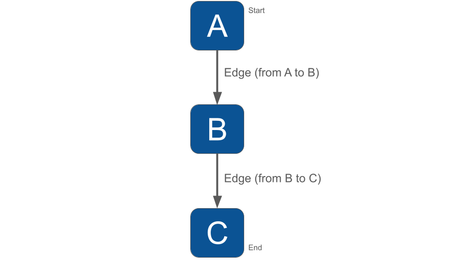

# Getting Started

Think of a Workflow as a smart flowchart for your AI applications. The idea behind Workflow is to allow developers to use all the NeuronAI components like AI providers, embeddings, data loaders, chat history, vector store, etc, as standalone components to create totally customized agentic entities.

Agent and RAG classes represent a ready to use implementation of the most common patterns when it comes to retrieval use cases, or tool calls, structured output, etc. Workflow allows you to program your agentic system completely from scratch. Agent and RAG can be used inside a Workflow to complete tasks as any other component if you need their built-in capabilities.

What makes NeuronAI Workflows special is **interruption and human-in-the-loop** capabilities. This means your agentic system can pause mid-process, ask for human input, wait for feedback, and then continue exactly where it left off – even if that's hours or days later.

Workflow lets you create a step-by-step process where AI handles what it does best, and humans step in when judgment or oversight is needed.

Imagine you're building a content moderation system. Instead of having AI make final decisions about borderline content, your Workflow can:

1. Analyze the content using AI
2. Flag anything uncertain
3. **Pause and ask a human moderator for review**
4. Wait for the human decision
5. Continue processing based on that feedback

The key breakthrough is that **interruption isn't a bug – it's a feature**. Your Workflow remembers exactly where it stopped, what data it was working with, and what question it needs answered.

### Inspector

Before moving into the Workflow creation process, we recommend having the monitoring system in place. It could make the learning curve of how Workflow works much more easier. The best way to monitoring Workflow is with [Inspector](https://inspector.dev/).

After you sign up at the link above, make sure to set the `INSPECTOR_INGESTION_KEY` variable in the application environment file to monitoring Workflow execution:


```
INSPECTOR_INGESTION_KEY=nwse877auxxxxxxxxxxxxxxxxxxxxxxxxxxxx
```


### Create a Workflow

A Workflow in NeuronAI is made up of two elements:

**Nodes**, with each node responsible for handling a unit of execution (manipulate data, call an agent, etc.).

**Edges**, responsible to define how the workflow must move from one node to the next. They can be conditional branches or fixed transitions.


**In short**: Nodes do the work, Edges tell what to do next.


As an illustrative example, let's consider a simple workflow with two nodes. The connection (Edge) tells the workflow to go from A to B to C.

```php
<?php

namespace App\Neuron\Workflow;

use App\Neuron\Workflow\InitialNode;
use App\Neuron\Workflow\MiddleNode;
use App\Neuron\Workflow\FinishNode;
use NeuronAI\Workflow\Edge;
use NeuronAI\Workflow\Workflow;

class SimpleWorkflow extends Workflow
{
    public function nodes(): array
    {
        return [
            new InitialNode(),
            new MiddleNode(),
            new FinishNode(),
        ];
    }
    
    public function edges(): array
    {
        return [
            // Tell the workflow to go to MiddleNode after InitialNode
            new Edge(InitialNode::class, MiddleNode::class),
            
            // Tell the workflow to go to FinishNode after MiddleNode
            new Edge(MiddleNode::class, FinishNode::class),
        ];
    }
    
    protected function start(): string
    {
        return InitialNode::class;
    }
    
    protected function end(): array
    {
        return [
            FinishNode::class,
        ];
    }
}
```

<figure><figcaption></figcaption></figure>

### Why Use Workflows Instead of Regular Scripts?

You might be thinking: "This sounds great, but why can't I just write a regular PHP script with some if-statements and functions?" It's a fair question, and one I heard a lot while building NeuronAI. The answer becomes clear when you consider what happens when your process needs to pause, wait, and resume.

Another scenario that is practically impossible to reproduce with a procedural approach is when you need complex workflows with many branches, several loops and intermediate checkpoints, etc. When you are at the beginning and your use case is yet quite simple you couldn't see the real potential of Workflow, and it's normal. Keep in mind that if things hit the fan, NeuronAI already has a solution to help you scale.

### Development Benefits

From a developer perspective, Workflows solve several painful problems:

**Model and maintain complex iterations**: With these simple building blocks you will be able to create simple processes with a few steps, up to complex workflows with iterative loops and intermediate checkpoints.

**Human in the Loop**: Seamlessly incorporates human oversight. You can deploy AI in sensitive areas because humans are always in the loop for critical decisions.

**Debugging with inspector**: Instead of wondering why your AI made a particular decision, you can see exactly how humans and AI collaborated at each step.

**User Trust**: When users know a human reviewed important decisions, they're more likely to trust and adopt your AI system.

### Integrate with NeuronAI components ecosystem

NeuronAI Workflow lets you use individual framework components independently, giving you flexibility to integrate specific AI features into your existing workflows without the pre-packaged implementation of the `Agent` and `RAG` classes.

For example, you can include a chat history at the workflow level:

```php
$state = new WorkflowState();
$state->set('chat_history', new FileChatHistory(__DIR__, 'workflow'));

// Run the workflow passing the initial state
$workflow = new SimpleWorkflow();
$state = $workflow->run($state);
```

Inside nodes you can use the chat history methods to add and retrieve messages:

```php
class ExampleNode extends Node
{
    public function run(WorkflowState $state): WorkflowState
    {
        $message = new UserMessage(...);
        
        $state->get('chat_history')->addMessage($message);
        
        $response = $agent->chat($message);
        
        $state->get('chat_history')->addMessage($response);
        
        return $state;
    }
}
```
