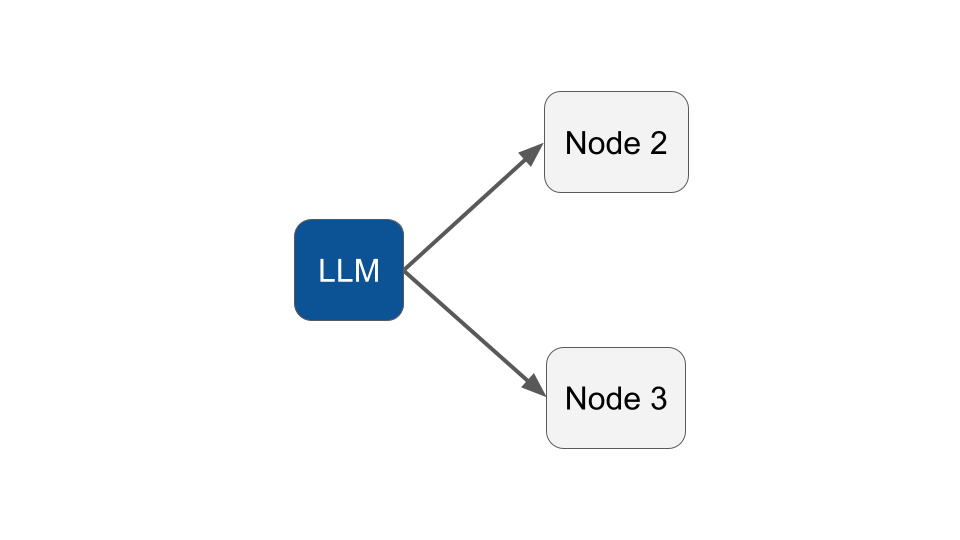

# Node, Edge & State

### Node

A Node is a simple PHP class that extends the `NeuronAI\Workflow\Node` class. The only required method to implement is `run` where you can implement the logic for the node execution.

```php
<?php

namespace App\Neuron\Workflow\Nodes;

use NeuronAI\Workflow\Node;
use NeuronAI\Workflow\WorkflowState;

class InitialNode extends Node
{
    public function run(WorkflowState $state): WorkflowState
    {
        $answers = \array_map(fn($item) => $item['answer'], $state->get('answers'));
    
        $state->set('data', $answers);
        
        return $state;
    }
}
```

As you can see in the example above, you are not forced to run agents inside each node, but even simple PHP code. So you can create a Workflow to do practically anything! Build an agent, a RAG flow, an extraction flow, or anything else you want.

Obviously most of the times you will be interested in running Agents, but the take away here is that you are able to create processes that mix multi agent interactions and also add some data manipualtion tasks, or checkpoints in the middle.

### Workflow State

As you can see in the snippet of the Node implementation, a node gets the `WorkflowState` as input, and return the state as output. The most important role of a node is indeed to interact with the workflow state.

State is central to how Workflow operates. Each execution of the workflow creates a state that is passed between the nodes, with each node updating and reading the internal state as it executes. This process allows the workflow to maintain context and memory, critical for stateful applications.

Within Workflow, the "state" serves as a memory bank that records and tracks all the information processed by the agntic system. It’s similar to a notebook where the system captures and updates data as it moves through various stages of the workflow execution.

Whe you run the Workflow you can eventually pass an initial state with the user input for example. At first it will be injected into the start node.

```php
// Create a state with some initial data
$state = new WorkflowState();
$state->set('user_input', 'I want to know more about NeuronAI.');

// Run the workflow passing the initial state
$workflow = new SimpleWorkflow();
$state = $workflow->run($state);

// Use the final version of the state after the Workflow execution
echo $state->get('answer');
```

### Edge

Edges define the relationships and flow between nodes. They indicate how the state should be transferred from one node to another, allowing for the seamless progression of tasks. These edges essentially map the order of execution, guiding the Workflow from one task to the next. When a node completes its task, the edge determines where the result flows and which node is triggered next in the sequence.

```php
class SimpleWorkflow extends Workflow
{
    ...
    
    public function edges(): array
    {
        return [
            // Tell the workflow to go to Middle after Initial
            new Edge(InitialNode::class, MiddleNode::class),
            
            // Tell the workflow to go to Final after Middle
            new Edge(MiddleNode::class, FinalNode::class),
        ];
    }
    
    ...
}
```

### Conditional Edges

Conditional edges are specialized edges that introduce decision-making logic into the workflow. Rather than simply following a linear path, conditional edges enable agents to evaluate criteria before choosing the next node. For example, after processing some data, the agent may take one path if a condition is met (e.g., if a query returns a valid result) and a different path if the condition is not met (e.g., retrying the task). This makes workflows highly flexible, as it can dynamically adapts based on real-time information or results.

Immagine you want to implement the workflow below:

<figure><figcaption></figcaption></figure>

It can be implemented as below with two conditional edges, one for each branch:

```php
class SimpleWorkflow extends Workflow
{
    ...
    
    public function edges(): array
    {
        return [
            new Edge(
                LLMNode::class, 
                Node1::class,
                fn(WorkflowState $state) => $state->get('accuracy') > 0.8
            ),
            
            new Edge(
                LLMNode::class, 
                Node2::class,
                fn(WorkflowState $state) => $state->get('accuracy') <= 0.8
            ),
        ];
    }
    
    protected function start(): string
    {
        return LLMNode::class;
    }
    
    protected function end(): array
    {
        return [
            Node1::class,
            Node2::class,
        ];
    }
    
    ...
}
```
